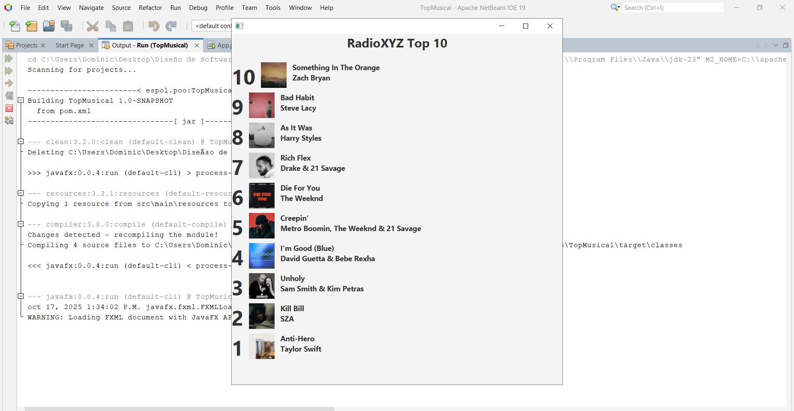

# 01-GitRamas | Grupo 04

## Rama: titulo (Integrante 1)
Se cambió el título principal del Top 10 a "Grandes éxitos 2022-2023"

  <kbd>
    
    
  </kbd>

## Rama: orden (Integrante 2)
Se modificó el orden de las canciones del Top 10 para mostrarlas en forma descendente.

  

Evidencia rama `artista`
